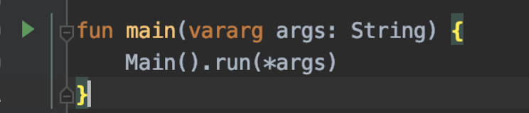
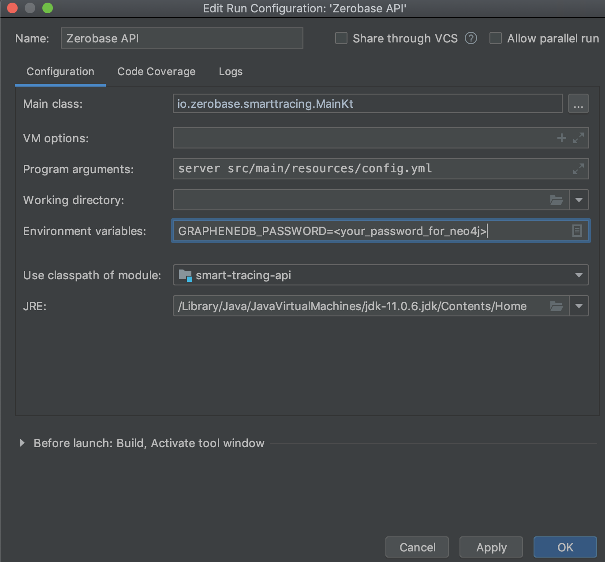

# Zerobase API Server

This repository contains the back end for the Zerobase smart tracing platform. Refer to the [smart-tracing repo](https://github.com/zerobase-io/smart-tracing) for the front end. We are using Kotlin and Neo4j with cloud storage on Heroku. We are using Dropwizard for the REST framework. Kotlin requires Java and Maven.

## Set up for the project

### Kotlin
The backend is written in Kotlin. While you can work on it in any editor, such as vim or VS Code, it is significantly easier to use an IDE. We recommend [IntelliJ](https://www.jetbrains.com/idea/download/index.html).

### Java 11

This project targets the current LTS version of Java: 11. You are welcome to use any of the JDK implementations locally, but deployments
will be done using an AdoptOpenJDK build. If you want to use Oracle's official JDK, it can be dowloaded [here](https://www.oracle.com/java/technologies/javase-jdk11-downloads.html).
We recommend, however, that you install the JDK using a package manager, such as `brew` on macOS, to easily stay up to date.

### Maven
Maven is a dependency management and build tool that is commonly used in the Java world. It is available for installation via package
managers, such as `brew` on macOS, for easy updating (recommended way) but can also be installed manually.

#### Install manually
* Download Maven from [here](https://maven.apache.org/download.cgi)
* Follow these installation instructions [here](https://maven.apache.org/install.html)
* Add the full path to your ~/.bash_profile, ~/.zshrc, or similar.


### Docker
Docker is used to run a graph database while running the project locally.

* Install docker manually by following this [guide](https://www.docker.com/get-started) or via a package manager.
* Pull the Gremlin server image
    ```sh
    $ docker pull tinkerpop/gremlin-server
    ```
* Run the gremlin image
    ```sh
    $ docker run -d -8182 --name=zerboase-db tinkerpop/gremlin-server:latest
    ```
By default, there are no credentials for the local install

#### Run Gremlin without Docker
If you're unable to use Docker to run Gremlin, there is an alternative available. The desktop version can be downloaded
from [here](https://www.apache.org/dyn/closer.lua/tinkerpop/3.4.6/apache-tinkerpop-gremlin-server-3.4.6-bin.zip). The configuration
instructions are found [here](http://tinkerpop.apache.org/docs/3.4.6/reference/#gremlin-server). The default configuration should
suffice.

## Project
After cloning the project there are two ways to deploy it locally: using an IDE or via the command line. By default, the app listens on
port 9000. You can override that with an environment variable of `PORT` if you need to.

### Running in an IDE
The following directions use Intellij as the IDE, but the steps should be similar if you are using a different IDE.

* If necessary, navigate to File/Project Structure. Update the SDK for the project to JDK11.
* Open `Main.kt`
* In `Main.kt`, click on the run button next to main and select `Create Main.kt` to create a run configuration.



* Set the name to something reasonable. If running locally, it's recommended to use the `local-config.yml` instead of
`config.yml`. The configuration will target running locally against Gremlin, while the normal config will target AWS Neptune.
* Set the program arguments as `server <the config file you want to use>`. Options for config files are:
    * `src/main/resources/config.yml`
    * `src/main/resources/local-config.yml`
* By default, the `local-config.yml` expects the database to be running at `localhost:8182`. If you need to override the port,
set an environment variable of `DB_PORT` to the port your gremlin server is running on.



* Click `OK` and run the configuration you just made.

### Running from the command line.
* From the project's root directory, build the project.
    ```sh
    $ mvn clean install
    ```
* Set the environment variables (if needed), either as an export or inline, and run the jar.
    * Export
        ```sh
        $ export DB_PORT=12345
        $ java -jar target/smart-tracing-api.jar server target/classes/local-config.yml
        ```
    * Inline
    ```sh
    $ PORT=8888 java -jar target/smart-tracing-api.jar server target/classes/local-config.yml
    ```
### Debugging / Calling end points
* Once you're running the project, you can double check if all is well by visiting `http://localhost:8081` in your browser. You
  shoudl see a simple page that exposes metrics and healthcheck results. You can also curl `http://localhost:8081/healthchecks` if
  you prefer the command line.
