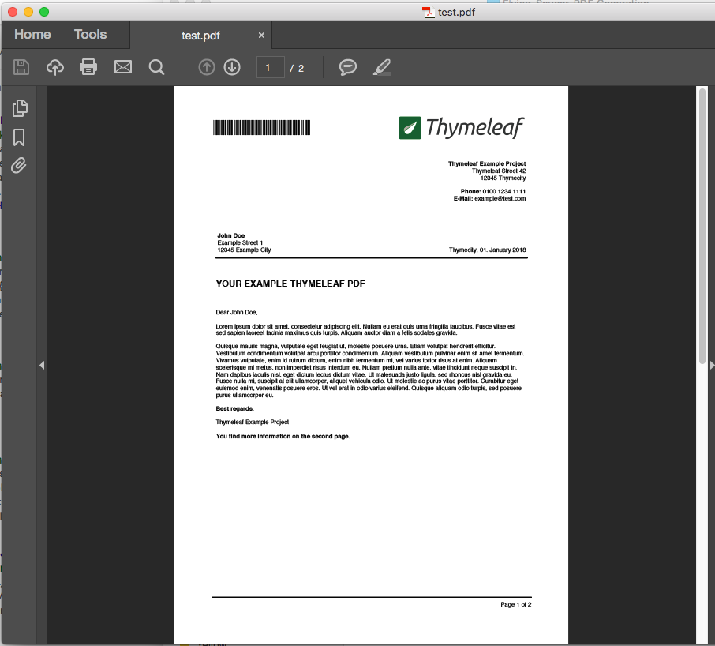

# Flying Saucer PDF Generation
------------------------------

Open this repository in an IDE (ex: Intellij).
The project can be build with Gradle (using `build.gradle`) or Maven (using `pom.xml`), both updated with the QR code generation library being used. 

The current library is being used for QR generation is due to ease and the process is separately generating a QR code that is referenced by html. The itext library can generate barcode qr code -- something also to explore as well. 

This demo project shows how to generate a nicely styled PDF with Flying Saucer and Thymeleaf templates.

In order to generate the PDF run the JUnit test that calls ```generatePdf``` function:

    src/test/GeneratePdf.java

You can also run the main function to run both a qr generation and pdf generation here: 

    src/test/GenerateQRCode.java

In ```src/test/pdfs``` path will hold the generation of a PDF called:

    zerobase-qr.pdf
    
A copy of the generated PDF is checked-in, in case you want to see what is generated:

    example_of_generated_pdf.pdf        

There is a copy of the Zerobase generated pdf called example-zerobase-qr.pdf


